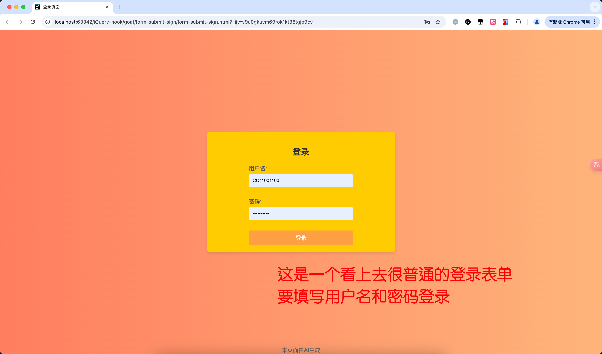
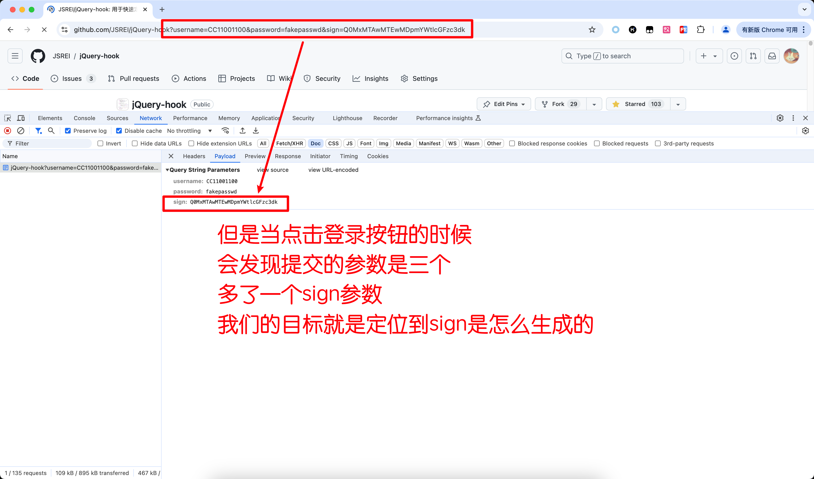
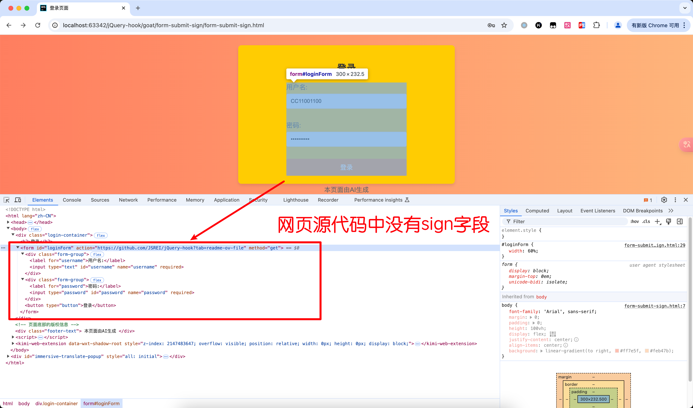
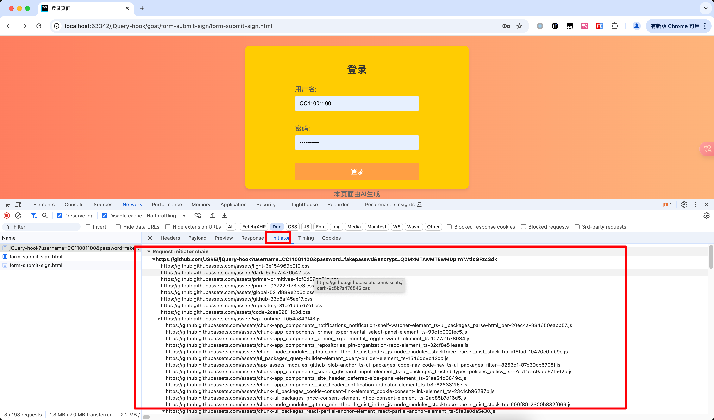
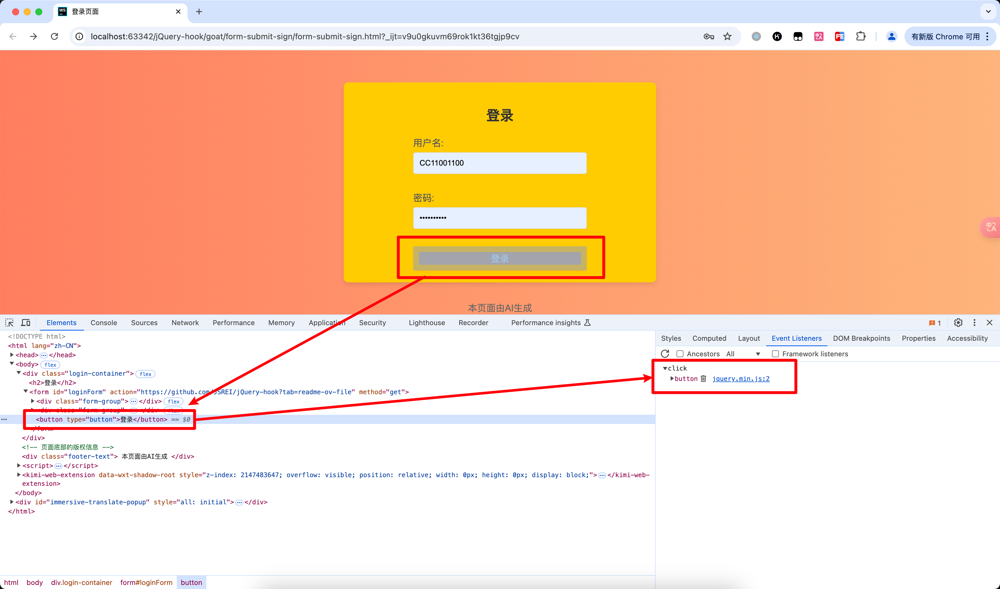
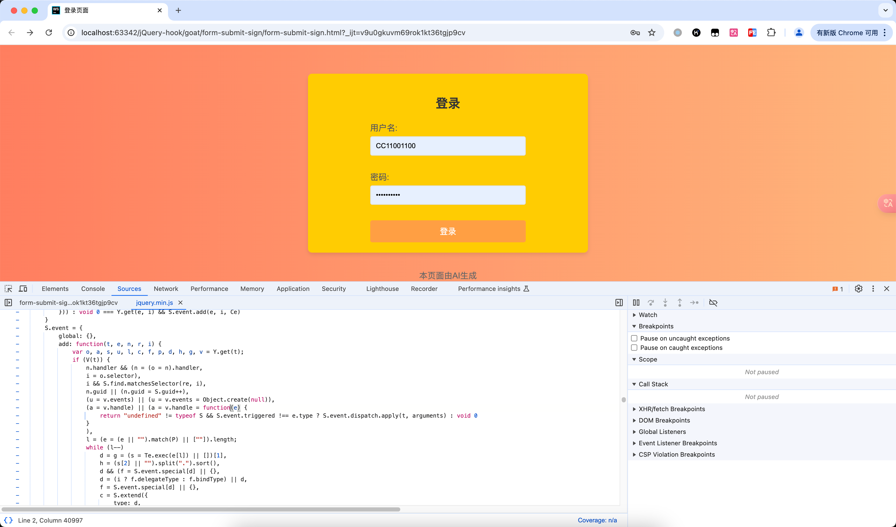
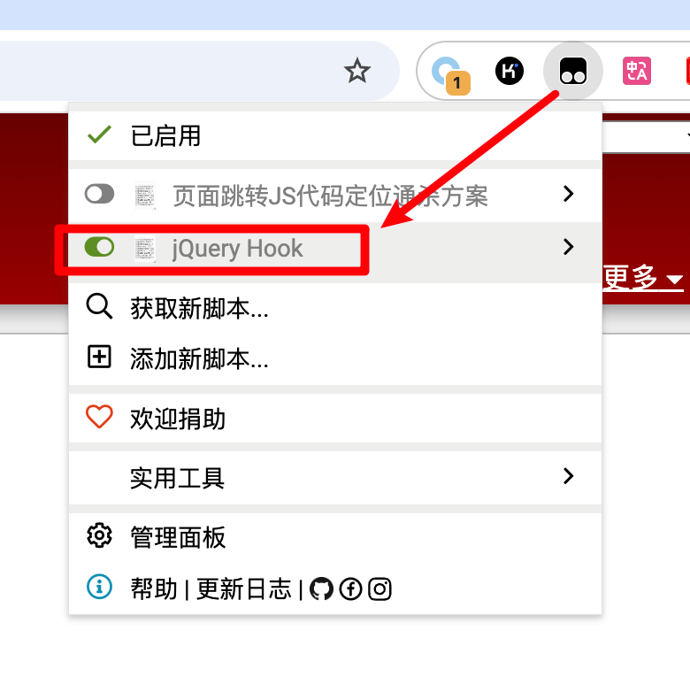
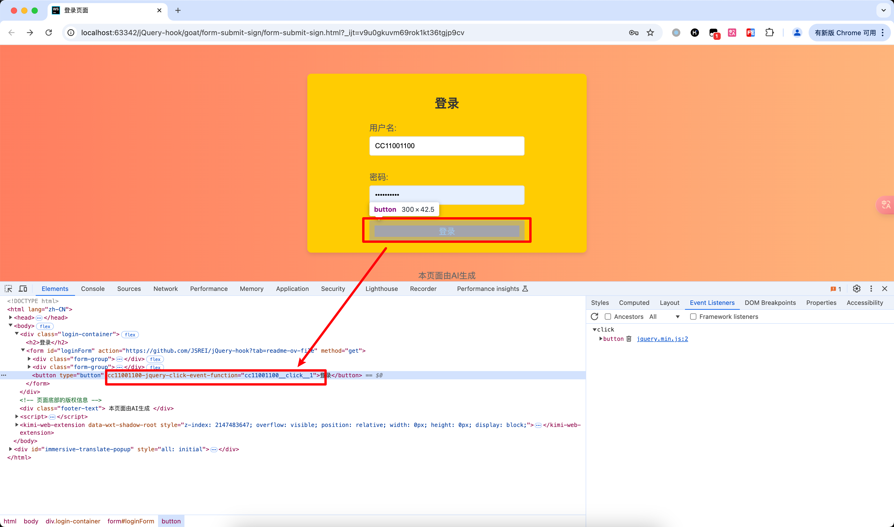
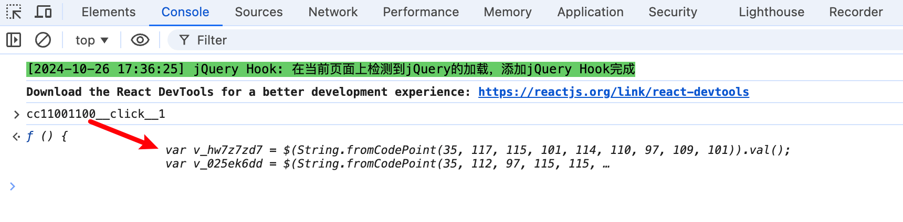
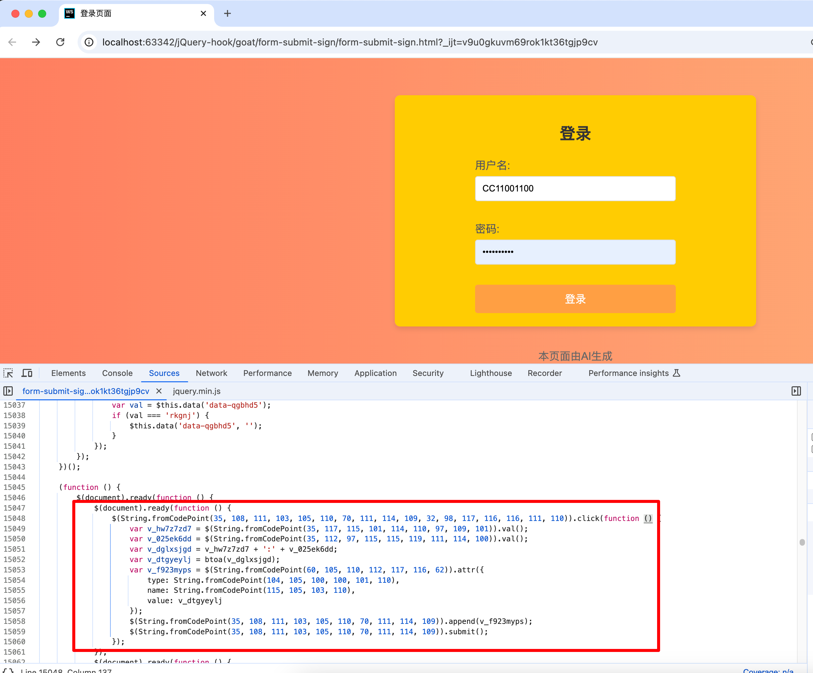

[简体中文](README.md) | English

# jQuery Form Parameter Encryption Challenge Writeup

## Table of Contents

1. [Challenge Objective](#1-challenge-objective)
2. [Launching the Challenge](#2-launching-the-challenge)
3. [Analysis Process](#3-analysis-process)

---

### 1. Challenge Objective
When opening the page, you encounter a login form with only two input fields for the username and password:



After entering the username and password and clicking the "Login" button to submit the form, a parameter named `sign` is added to the submitted parameters. Our goal is to determine the logic behind the generation of this `sign` parameter:



---

### 2. Launching the Challenge
Access the challenge hosted online directly:
- [Form Submit Sign Challenge](https://jsrei.github.io/jQuery-hook-goat/form-submit-sign/form-submit-sign.html)

---

### 3. Analysis Process
Initially, we thought this parameter was invisible. While it does not appear on the page, the associated code could be found in the web page's source code. Examining the entire code for the form, it appeared clean and empty:



Sometimes, by inspecting the ***Initiator*** in the Network tab, you can trace back to where the request originated and then see how the parameters were generated. However, this approach was not effective here. The stack trace was messy:



We then assumed that the `sign` parameter is generated when the login button is clicked. It's likely that an event was added to the button. By selecting the button element and checking its events in the web inspector, we found ourselves within the jQuery internal code, where the actual logic was hidden:





**This Script** (https://greasyfork.org/zh-CN/scripts/435556-jquery-hook) needs to be installed.

Once installed, enable the script.



Then, refresh the challenge page and use the "Inspect Element" feature to select the login button again. This time, the webpage elements have additional attributes:



The `cc11001100-jquery-click-event-function` indicates that this is a jQuery-set click event, and the associated code has been assigned to a global variable: `cc11001100__click__1`. Paste this function name into the console and view the code implementation and follow the code:



Then we located the place where the `sign` parameter is generated and the form is submitted:



The following JavaScript code, while not analyzed in detail here, shows that the `sign` parameter is generated from the username and password:

```javascript
$(document).ready(function () {
    $(String.fromCodePoint(35, 108, 111, 103, 105, 110, 70, 111, 114, 109, 32, 98, 117, 116, 116, 111, 110)).click(function () {
        var v1 = $(String.fromCodePoint(35, 117, 115, 101, 114, 110, 97, 109, 101)).val();
        var v2 = $(String.fromCodePoint(35, 112, 97, 115, 115, 119, 111, 114, 100)).val();
        var combined = v1 + ':' + v2;
        var sign = btoa(combined);
        $(String.fromCodePoint(60, 105, 110, 112, 117, 116, 62)).attr({
            type: String.fromCodePoint(104, 105, 100, 100, 101, 110),
            name: 'sign',
            value: sign
        });
        $(String.fromCodePoint(35, 108, 111, 103, 105, 110, 70, 111, 114, 109)).append('<input type="hidden" name="sign" value="' + sign + '">');
        $(String.fromCodePoint(35, 108, 111, 103, 105, 110, 70, 111, 114, 109)).submit();
    });
});